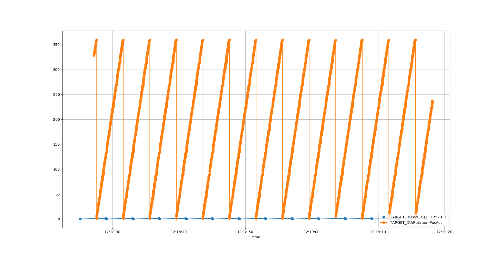
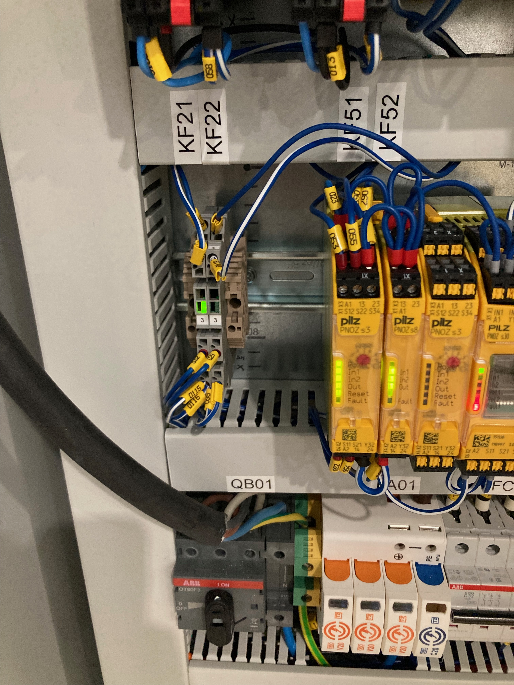

# Home sensor to timing system

Check that omron fiber optic sensor for homings ensors gives pulse once per rev.

```
camonitor -n -g10 TARGET_DU:ec0-s9-EL1252-BI1 TARGET_DU:Rotation-PosAct | tee homeSenor.log
```

```
(ecmccomgui_py35) [anderssandstrom@mcag-trgt-muts-log homeSensorToTiming]$ cat homeSenor.log | python ~/source/ecmccomgui/pyDataManip/plotCaMonitor.py 
Added PV: TARGET_DU:ec0-s9-EL1252-BI1
Added PV: TARGET_DU:Rotation-PosAct
Statistics: 
[<caPVArrayLib.caPVArray object at 0x7f39d7cc7208>, <caPVArrayLib.caPVArray object at 0x7f39d7cb2748>]
TARGET_DU:ec0-s9-EL1252-BI1[27] 0.0..1.0, mean: 0.48148148148148145, std: 0.49965694678637196
TARGET_DU:Rotation-PosAct[5023] 0.8557..359.9863, mean: 179.2554188134581, std: 103.62829637143912
```

Result:


Optocoupler:

