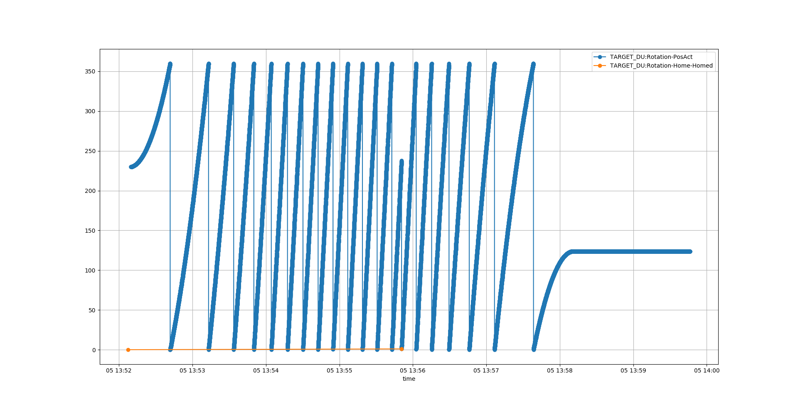

# Homing sequence

Plot:

```
(ecmccomgui_py35) [anderssandstrom@mcag-trgt-muts-log homing]$ cat home.log | grep "Pos\|Home"|python ~/source/ecmccomgui/pyDataManip/plotCaMonitor.py 
Added PV: TARGET_DU:Rotation-PosAct
Added PV: TARGET_DU:Rotation-Home-Homed
Statistics: 
[<caPVArrayLib.caPVArray object at 0x7f8f4f3db6a0>, <caPVArrayLib.caPVArray object at 0x7f8f3a66f748>]
TARGET_DU:Rotation-PosAct[42270] 0.0099..359.9985, mean: 168.06928105512188, std: 96.31870163036298
TARGET_DU:Rotation-Home-Homed[2] 0.0..1.0, mean: 0.5, std: 0.5
```
Result:



