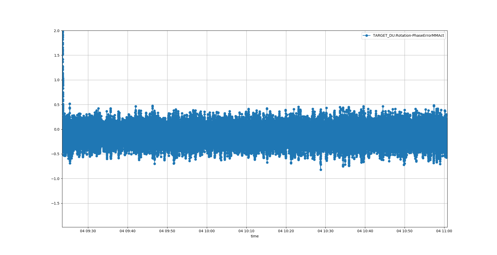

# Phasing
Phasing for atleast one hour like stated in chess doc

Phase mode:

Mode=Superimpose

Noise after approx 1h running, maybe encoder scratching against encoder ring

## Log data:
```
camonitor -g10  TARGET_DU:Rotation-PhaseErrorMMAct TARGET_DU:Rotation-VelLastSectorAct | tee phase0x.log
```

## Plot data
```
cat phase* | grep Phase | python ~/source/ecmccomgui/pyDataManip/plotCaMonitor.py 
```
Result:


Statistics:
```
(ecmccomgui_py35) [anderssandstrom@mcag-trgt-muts-log phasing]$ cat phase* | grep Phase | python ~/source/ecmccomgui/pyDataManip/plotCaMonitor.py 
Added PV: TARGET_DU:Rotation-PhaseErrorMMAct
Statistics: 
[<caPVArrayLib.caPVArray object at 0x7f26fff8c668>]
TARGET_DU:Rotation-PhaseErrorMMAct[85637] -108.9674502..109.0176284, mean: 0.7262471295648769, std: 11.698932558180115

```