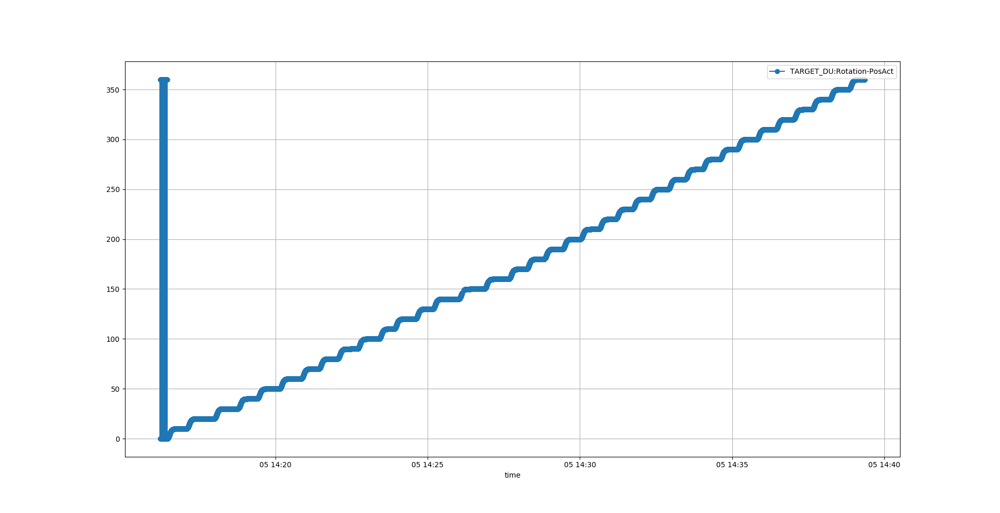
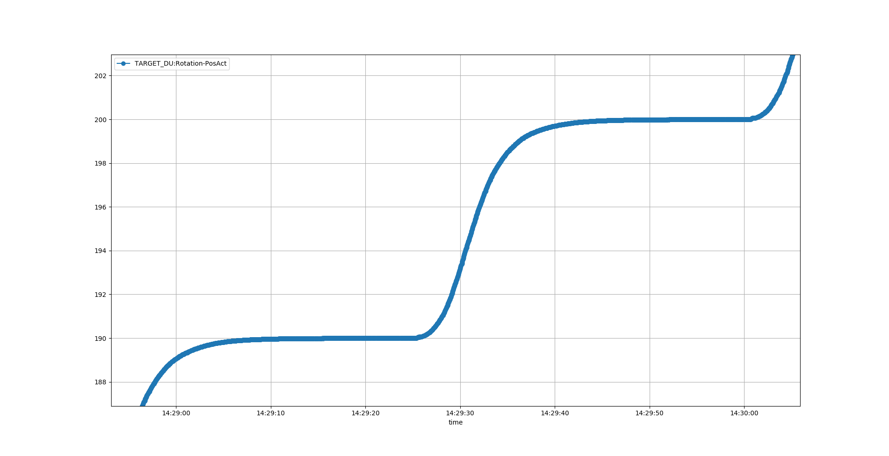

# Positioning 0..360deg step 10 deg

Plot:

```
cat pos0* | grep Pos | python ~/source/ecmccomgui/pyDataManip/plotCaMonitor.py 
Added PV: TARGET_DU:Rotation-PosAct
Statistics: 
[<caPVArrayLib.caPVArray object at 0x7fc0472e10f0>]
TARGET_DU:Rotation-PosAct[124626] 0.0..359.9999, mean: 174.41031349959079, std: 104.99005325452933
```
Result:




