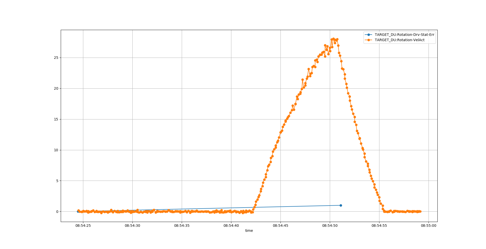

# Rotation

## Ovespeed test
Overspeed test PLC:
Have been tested several times.
* 28RPM act velo Works
* 25RPM set Velo Works

### Overspeed test in drive
Drive is limiting velocity setpoint at 25rpm and disables torque at 1.125*25=28RPM.
To test the overspeed protection in teh drive the following test was performed:
Process:
1. Disable software interlock in PLC
2. Set drive in torque mode (can be done from GUI)
3. Make sure all interlocks in PLC are OK (temperatures, enabled, .....)
4. Set a torque direclly from PLC (simple to force directlly from I/O = "Torque/force command value" ), for B02 a torque of 50 (5%) was enough
5. Have E-stop accessible (to abort test if needed, velo exceeding 28RPM)
6. Show a screen wich dispalys velocity
7. Execute command

Plot of velo and drive IL:

Indra drive diagnostic trace:

