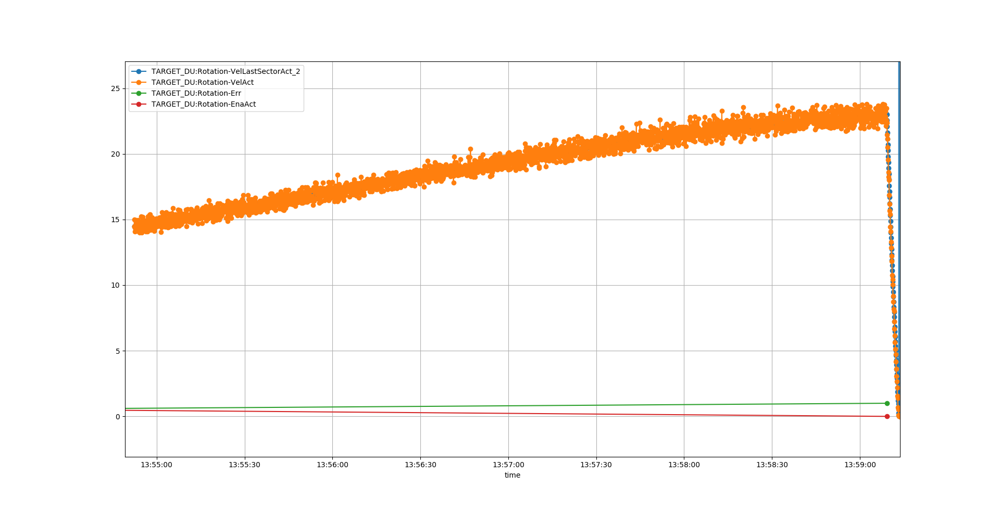

# Rotation


## Ovespeed test
### Overspeed test PLC:
Have been tested several times.
* 28RPM act velo Works
* 25RPM set Velo Works

Process:
1. Make sure all interlocks in PLC are OK (temperatures, enabled, .....)
2. Set limit of actual velo to 25 (same as setpoint) 
3. Have E-stop accessible (to abort test if needed, velo exceeding 28RPM)
4. Show a screen wich dispalys velocity
5. Execute command


Plot of velo and PLC error:


Picture of GUI PLC error:


Conclusion:

PLC overspeed interlock works as intended.

### Notes
```
# Sample data
camonitor -n -g10 TARGET_DU:Rotation-VelLastSectorAct TARGET_DU:Rotation-VelAct TARGET_DU:Rotation-Err | tee test_PLC_x.log

# Plot
conda activate ecmccomgui_py35
cat test_PLC_x.log | python ~/source/ecmccomgui/pyDataManip/plotCaMonitor.py 
```

### Overspeed test in drive
Drive is limiting velocity setpoint at 25rpm and disables torque at 1.125*25=28RPM.
To test the overspeed protection in teh drive the following test was performed:
Process:
1. Disable software interlock in PLC
2. Set drive in torque mode (can be done from GUI)
3. Make sure all interlocks in PLC are OK (temperatures, enabled, .....)
4. Set a torque direclly from PLC (simple to force directlly from I/O = "Torque/force command value" ), for B02 a torque of 50 (5%) was enough
5. Have E-stop accessible (to abort test if needed, velo exceeding 28RPM)
6. Show a screen wich dispalys velocity
7. Execute command

Plot of velo and drive IL:


Indra drive diagnostic trace:


Conclusion:

Drive overspeed interlock works as intended.

### Notes
```
# Sample data
camonitor -n -g10 TARGET_DU:Rotation-Drv-Stat-Err TARGET_DU:Rotation-VelAct TARGET_DU:Rotation-VelLastSectorAct | tee test_drive_x.log

# Plot
conda activate ecmccomgui_py35
cat test_drive_x.log | python ~/source/ecmccomgui/pyDataManip/plotCaMonitor.py 

``` 

## Normnal test for MPS

``` 
# Log data
camonitor -n -g10 TARGET_DU:Rotation-VelLastSectorAct TARGET_DU:Rotation-VelAct TARGET_DU:Rotation-Err TARGET_DU:Rotation-Drv-Stat-STOActiveCh1 TARGET_DU:Rotation-Drv-Stat-STOActiveCh2 | tee test_mps_x.log

# Change velo
caput TARGET_DU:Rotation-VelSetCmd 5

# ecmc PLC velo:
camonitor IOC_TEST:PLC-VelAct
``` 


